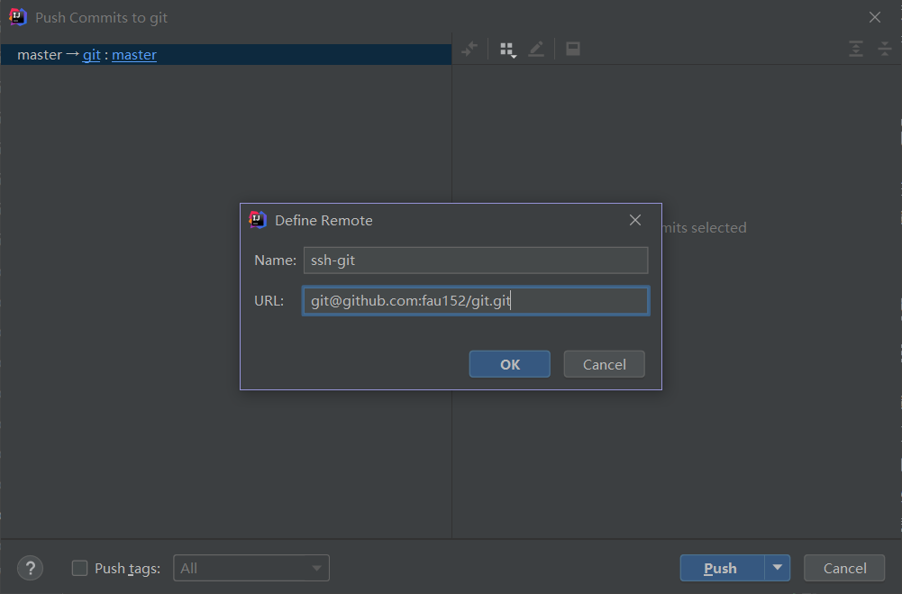

# 一、导入git
1. 设置->Version Control->Git
2. 选择Path to Git excutable，选择自己本地安装的git.exe程序

# 二、初始化本地库
1. vcs->Create Git Reposity
2. 选择文件夹，就选择本项目的根目录就行
3. 创建完成之后就会发现pom.xml文件变红了，这个和git中的红色文件是一样的，表示未添加到暂存区的文件

# 三、将pom.xml文件添加到暂存区 
## 将单个文件添加到暂存区
点击文件，右键->git->add即添加
## 将整个项目添加到暂存区
选中项目文件夹，右键->git->add
这个时候会弹出提醒：本项目包含git.ignore中配置的忽略文件，问要不要强制add到暂存区？选择canel不强制添加，即可

# 四、将修改后的项目提交到本地库

提交完成之后，之前的pom.xml文件等就不再是红色或者绿色，而是正常的黑色
- 红色：未添加到暂存区的
- 绿色：添加到暂存区未提交的
- 黑色：提交过的
- 蓝色：该文件被追踪过，但是之后又进行了修改

修改之后的文件，提交之后，点击changelist的文件，就可以看到这个版本相对上个版本的改变

# 五、查看当前版本以及切换版本

选择版本列表中某个历史版本，右键checkout revison切换到这个版本

# 六、创建分支和切换分支
## 创建分支
1. 项目文件夹右键->git->branches->new branche创建一个分支
2. 点击idea的右下角的分支符号，然后new branche创建分支
## 切换分支

点击要切换的分支checkout即切换到当前分支

# 七、合并分支
## 正常合并

1. 在hot-fix分支下对代码进行修改
2. 切换到master分支下
3. 点击hot-fix -> 点击Merge into Current将hot-fix分支的代码合并到master分支上
## 冲突合并

- 当hot-fix分支提交的代码和master提交的代码有冲突的时候
- 在master分支进行合并分支操作(Mergin into Current)时会弹出冲突对话框，提示我们手动合并
- 按照上图操作即可。

---
# 八、idea集成GitHub
## 1. Github账号添加
1. seting->version control->Github
2. 点击“加号”->Login with Token->Generate（由于账号密码登录比较困难，所以选择使用口令登录）
3. 点击所有权限，使得口令登录和账号密码登录有一样的效果
4. 点击Generate Token->复制Token然后登录（需要注意的是，请保存该token，因为当页面刷新的时候token将不再显示，需要重新生成）
    
## 2. 分享工程到GitHub
工具栏中Git->GitHub->Share Project on Github将该项目分享到GitHub上

## 3. 本地代码修改之后，push到远程库
1. 项目文件夹右键->git->push
2. 工具栏的Git->push

注意：这里默认使用的https协议的链接，我们也可以进行自定义，如下：
   （如果配置了GitHub免密登录，建议使用SSH协议）
   点击->后面的git，然后点击Define remote添加自定义
   

## 4. 拉取远程库代码合并本地库
  